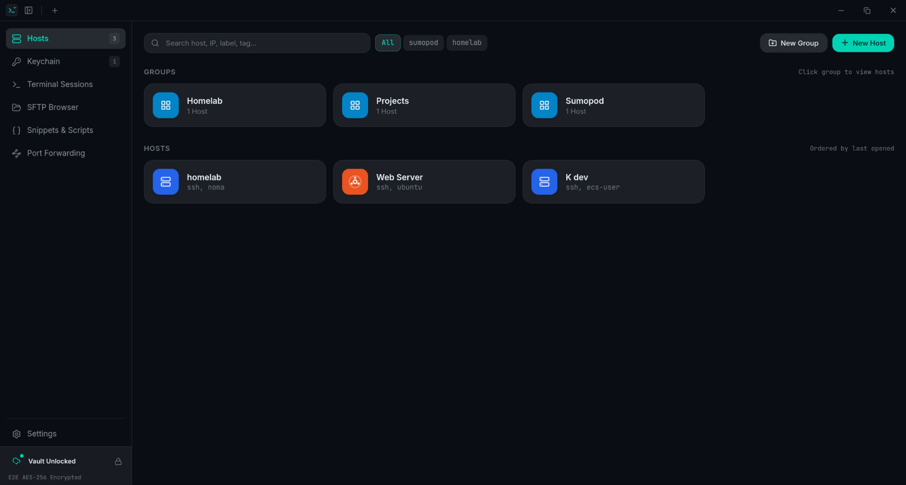

<p align="center">
  
</p>

<h1 align="center">Termimus</h1>

<p align="center">
  <strong>The Local-First, Zero-Knowledge SSH Client & Server Management Suite</strong><br>
  A modern, self-hosted Termius alternative for Linux, macOS, and Windows · <strong>v0.1.1</strong>
</p>

<p align="center">
  <a href="https://github.com/itsmefdil/termimus-ssh/releases"></a>
  <a href="https://github.com/itsmefdil/termimus-ssh/blob/main/LICENSE"></a>
  <a href="https://github.com/itsmefdil/termimus-ssh/pkgs/container/termimus-sync"></a>
  
  
  
  
</p>

<p align="center">
  
</p>

---

## ⚡ What is Termimus?

**Termimus** is an open-source, desktop SSH manager and terminal suite designed for engineers, sysadmins, and DevOps teams who refuse to store production credentials in third-party proprietary clouds.

Unlike SaaS alternatives that force cloud account registration, Termimus is **Local-First**: your database runs 100% offline via embedded SQLite, and your private keys and passwords never leave your machine unencrypted. When you need multi-device synchronization, Termimus connects to your own **Self-Hosted Go Sync Relay** using end-to-end zero-knowledge encryption — the server is a blind relay that cannot decrypt your data.

---

## 📥 Download

Prebuilt installers for every release are published automatically to the **[GitHub Releases](https://github.com/itsmefdil/termimus-ssh/releases/latest)** page — no build tools required.

| Platform | Installer | Notes |
|---|---|---|
| 🐧 Linux | `.deb` / `.AppImage` | Debian/Ubuntu package or portable AppImage (any distro) |
| 🍎 macOS | `.dmg` | Universal binary — runs natively on both Intel and Apple Silicon |
| 🪟 Windows | `.msi` / `.exe` | MSI installer or NSIS setup executable |

> Prefer to build from source, or want to contribute? See [Getting Started](#-getting-started) below.

---

## ✨ Features at a Glance

### 🖥️ Native Terminal Experience
- **Async Rust SSH Engine**: Multi-tab terminal powered by `russh` and `@xterm/xterm` 6.
- **Session Geometry Protection**: Background tabs stay mounted without collapsing to 0×0 geometry, preventing remote `htop`, `vim`, and curses TUIs from corrupting due to bogus SIGWINCH events.
- **Quick Connect**: Instant fuzzy-search launcher accessible anywhere with `Ctrl+K`.

### 📂 Dual-Pane SFTP & In-App Code Editor
- **Seamless Transfers**: Dual-pane local ↔ remote browser with fast click-to-transfer navigation.
- **Direct Remote Editor**: View and edit configuration files directly over SFTP with syntax highlighting and keyboard shortcut saving (`Ctrl+S`).

### 🔑 Keychain & Identity Management
- **Private Key Vault & Import**: Securely store and organize SSH private keys (OpenSSH, PEM, PuTTY). Import directly from local key files or paste PEM text.
- **Instant Public Key Derivation**: Automatically derive OpenSSH public key lines (`ssh-ed25519`, `ssh-rsa`, `ecdsa`) and SHA256 fingerprints from imported private keys to paste into remote `authorized_keys`.
- **Private Key Reveal & Copy**: Securely inspect or copy decrypted private keys on demand when the vault is unlocked, protected with privacy blur.
- **Password Identities**: Store reusable username & password combinations to assign across multiple hosts without re-typing.

### 🌐 Port Forwarding & SSH Tunnels
- **Multi-Type Tunnels**: Support for Local (`-L`), Remote (`-R`), and Dynamic SOCKS5 (`-D`) port forwarding.
- **Live Status Toggles**: Monitor and manage forwarding rules with real-time active indicators.

### 📜 Snippets & Scripts
- **Instant Script Runner**: Store frequently used shell scripts, deployment commands, and system diagnostics.
- **Active Tab Injection**: Send snippets straight into your running terminal session with a single click.

### 🔒 Enterprise-Grade Local Security
- **Zero-Knowledge Vault**: All passwords and keys are encrypted at rest with **AES-256-GCM** using keys derived via **Argon2id**.
- **OS Keyring Integration**: Optional silent auto-unlock on launch using your desktop's secure credential store (**KWallet / GNOME Secret Service** on Linux, **macOS Keychain**, or **Windows Credential Manager**).
- **Configurable Auto-Lock**: Automatically lock the vault and zero out memory after 15m/1h of inactivity or on window focus loss.
- **TOFU Host-Key Verification**: Trust-On-First-Use host key fingerprinting with hard rejection on key mismatch across SSH, SFTP, and tunnels to shield against Man-in-the-Middle (MITM) attacks.

### ☁️ Self-Hosted Multi-Device Sync
- **Zero-Knowledge Relay**: Self-host our ultra-lightweight Go sync server (`server/`) with Docker.
- **Real-Time WebSocket Sync**: Connected devices receive instant push notifications when changes occur on another machine.
- **Safe Merging**: Sync merges incoming updates without overwriting locally trusted server fingerprints.

---

## 🏛️ Architecture

```
┌─────────────────────────────────┐               ┌─────────────────────────────────┐
│     Termimus (Work Laptop)      │               │      Termimus (Home Desktop)    │
│  - Tauri v2 + Rust + React 19   │               │  - Tauri v2 + Rust + React 19   │
│  - Local SQLite (termimus.db)   │               │  - Local SQLite (termimus.db)   │
│  - AES-256-GCM Encryption Key   │               │  - AES-256-GCM Encryption Key   │
└────────────────┬────────────────┘               └────────────────▲────────────────┘
                 │                                                 │
                 │   Push E2EE Ciphertext Bundle                   │   Pull & Auto-Merge
                 │   (Server cannot read payload)                  │   (WebSocket Event)
                 ▼                                                 │
      ┌─────────────────────────────────────────────────────────────────┐
      │             Termimus Sync Server (Go / Docker)                  │
      │         ghcr.io/itsmefdil/termimus-sync:latest                  │
      │                                                                 │
      │  - Pure Go SQLite (modernc.org/sqlite, zero CGO)                │
      │  - Blind Relay Storage (< 20MB RAM)                             │
      │  - Real-time WebSocket Event Hub (`SYNC_UPDATED`)               │
      └─────────────────────────────────────────────────────────────────┘
```

### Component Versions

| Component | Version | Package |
|---|---|---|
| Desktop Client (Tauri + Rust + React) | `v0.1.1` | [Releases](https://github.com/itsmefdil/termimus-ssh/releases) |
| Self-Hosted Sync Server (Go) | `v0.1.1` | [`ghcr.io/itsmefdil/termimus-sync`](https://github.com/itsmefdil/termimus-ssh/pkgs/container/termimus-sync) |

---

## 🚀 Getting Started

### 1. Running Desktop App (Development)

#### Prerequisites
- [Rust](https://www.rust-lang.org/tools/install) (via `rustup`)
- [Bun](https://bun.sh/) (or Node.js 20+)
- Linux system libraries:
  ```bash
  sudo apt install -y pkg-config build-essential \
    libwebkit2gtk-4.1-dev libssl-dev \
    libayatana-appindicator3-dev librsvg2-dev
  ```

#### Start Desktop App
```bash
# Clone the repository
git clone https://github.com/itsmefdil/termimus-ssh.git
cd termimus-ssh

# Install frontend dependencies
bun install

# Run in Tauri dev mode
bun run tauri dev
```

#### Build Release Package (Debian, AppImage, or Binary)
```bash
bun run tauri build
```
Compiled bundles will be located in `src-tauri/target/release/bundle/`.

---

### 2. Running Self-Hosted Sync Server

The sync server is packaged as a lightweight, multi-architecture Docker container (`linux/amd64` and `linux/arm64`).

#### Option A: Docker (Single Command)
```bash
docker run -d \
  --name termimus-sync \
  -p 8080:8080 \
  -v termimus_data:/data \
  -e TERMIMUS_AUTH_TOKEN="your-secure-random-token" \
  --restart unless-stopped \
  ghcr.io/itsmefdil/termimus-sync:latest
```

#### Option B: Docker Compose
Create `docker-compose.yml`:
```yaml
services:
  termimus-sync:
    image: ghcr.io/itsmefdil/termimus-sync:latest
    container_name: termimus-sync
    restart: unless-stopped
    ports:
      - "8080:8080"
    volumes:
      - ./data:/data
    environment:
      - PORT=8080
      - DB_PATH=/data/sync.db
      - TERMIMUS_AUTH_TOKEN=your-secure-random-token
```
Run with:
```bash
docker compose up -d
```

#### Option C: Run from Source (Go)
```bash
cd server
export TERMIMUS_AUTH_TOKEN="your-secure-random-token"
export PORT="8080"
go run ./cmd/server
```

---

## 🔐 Security & Cryptography Model

Termimus enforces defense-in-depth principles:

| Domain | Mechanism | Implementation Detail |
|---|---|---|
| **Key Derivation** | Argon2id | 16-byte random salt, high-memory cost derivation for master password. |
| **Data Encryption** | AES-256-GCM | Authenticated symmetric cipher with unique 12-byte nonces generated per item via OS RNG (`OsRng`). |
| **Host Key Integrity** | TOFU / SHA-256 | Strict fingerprint validation on every connection; mismatches abort immediately to prevent MITM attacks. |
| **Memory Hygiene** | Zeroization | Derived keys stored in memory are zeroized on vault lock using `zeroize`. |
| **OS Keyring** | System Keyring | Derived key is securely delegated to KWallet, GNOME Secret Service, macOS Keychain, or Windows Credential Manager. |
| **Blind Sync** | E2EE Envelope | Server accepts only version 2 encrypted bundles; zero plaintext leakage. |

---

## 📁 Repository Structure

```
termimus/
├── src/                          # React 19 Frontend
│   ├── components/
│   │   ├── layout/               # Header, Sidebar, QuickConnect, ConfirmModal
│   │   ├── hosts/                # Host management, folder tree, latency badges
│   │   ├── terminal/             # Xterm.js terminal view & session tabs
│   │   ├── sftp/                 # Dual-pane browser & remote code editor
│   │   ├── keychain/             # KeyModal, IdentityModal, public key derivation
│   │   ├── tunnels/              # Port forwarding manager
│   │   ├── snippets/             # Scripts library
│   │   ├── sync/                 # Self-hosted cloud sync manager
│   │   ├── vault/                # Backup & restore components
│   │   └── settings/             # Tabbed settings suite (full-width)
│   ├── stores/                   # Zustand domain stores
│   └── lib/                      # Tauri typed invoke wrappers
│
├── src-tauri/                    # Rust Backend (Tauri v2)
│   └── src/
│       ├── ssh/                  # Russh async client & TOFU verification
│       ├── sftp/                 # Russh-sftp engine & local filesystem
│       ├── tunnel/               # Channel direct TCP/IP forwarder
│       ├── vault/                # AES-256-GCM & Argon2id encryption manager
│       ├── sshkey/               # ED25519/RSA/ECDSA key generation & derivation
│       ├── db/                   # SQLite schema, queries & backup engine
│       └── commands/             # Tauri IPC command handlers
│
├── server/                       # Self-Hosted Sync Server (Go)
│   ├── cmd/server/               # Server entrypoint
│   ├── internal/                 # DB (pure Go SQLite), Hub (WebSockets), Handlers
│   ├── Dockerfile                # Multi-stage minimal container
│   ├── docker-compose.yml        # Production-ready compose configuration
│   └── README.md                 # Server documentation
│
└── .github/workflows/            # GitHub Actions CI/CD (Multi-arch GHCR build)
```

---

## 🤝 Contributing

Contributions, issues, and feature requests are welcome!

1. Fork the Project
2. Create your Feature Branch (`git checkout -b feat/amazing-feature`)
3. Commit your Changes (`git commit -m 'feat: add amazing feature'`)
4. Push to the Branch (`git push origin feat/amazing-feature`)
5. Open a Pull Request

---

## 📄 License

Distributed under the **MIT License**. See [`LICENSE`](./LICENSE) for more information.

---

<p align="center">
  Built with ❤️ for privacy-minded sysadmins and developers.
</p>
